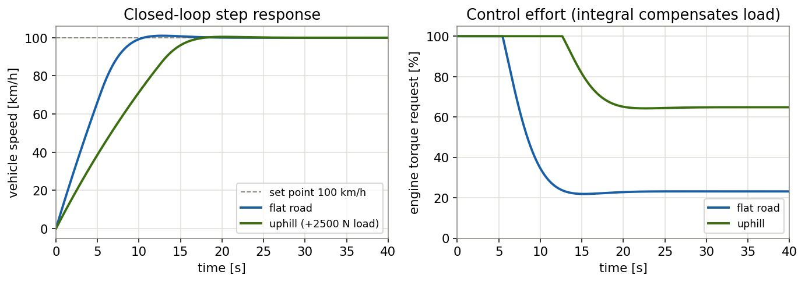
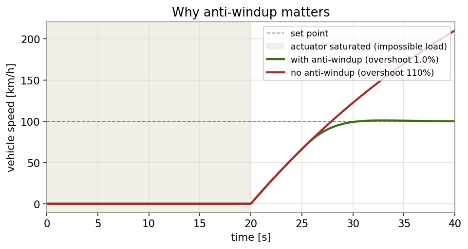

# Cruise Control — Model-Based Design (Simulink → AUTOSAR Classic → STM32F407)


-brightgreen)
-lightgrey)


A production-style **Model-Based Design (MBD)** demonstration of an automotive **cruise control** software function, taken from control design all the way to embedded integration:

> **Simulink/Stateflow model → AUTOSAR Blockset code generation (`autosar.tlc`, ARXML R23-11) → STM32F407 HAL integration with a simplified RTE.**

The controller is a **PI speed regulator with back-calculation anti-windup and bumpless transfer**, packaged as an AUTOSAR Classic Software Component (SWC). The control law is verified by simulation and by compiling and running the generated C against a vehicle plant model.

---

## Table of contents
- [Why this project](#why-this-project)
- [System architecture](#system-architecture)
- [Control design](#control-design)
- [Verification results](#verification-results)
- [AUTOSAR interface](#autosar-interface)
- [Repository layout](#repository-layout)
- [Build &amp; run](#build--run)
- [Engineering highlights](#engineering-highlights)
- [License](#license)

---

## Why this project

Cruise control is a compact but complete example of an automotive control function. It exercises the full skill set expected of a **Software Function / Software Control Developer**:

- closed-loop control theory (PI tuning, integrator anti-windup, bumpless transfer);
- the **AUTOSAR Classic** component model (SWC, ports, runnables, RTE, ARXML);
- the industrial **MBD toolchain** (Simulink model → Embedded Coder/AUTOSAR Blockset → target C);
- bare-metal **integration** on an STM32F407 (timers, ADC, PWM, ISRs);
- and an evidence-based **verification** mindset (SIL + on-target-equivalent C testing).

---

## System architecture

```
            ┌─────────────┐  CcEna / VehSpdSetPt   ┌──────────────────┐  EngTqReq   ┌─────────────┐
  HMI  ───► │  CcModeMgr  │ ─────────────────────► │  CruiseControl   │ ──────────► │  Throttle / │
 buttons    │ state machine│                       │  SWC (PI + AW)   │   [%]       │  Engine     │
            └─────────────┘                        └──────────────────┘             └─────────────┘
                  ▲                                          ▲
                  │ VehSpdLgt                                │ VehSpdLgt (feedback)
                  └──────────────────────────────────────────┘
```

- **`CruiseControl`** — the control SWC (auto-generated C). Holds the PI loop with anti-windup. This is the core deliverable.
- **`CcModeMgr`** — a small state machine (`OFF / ACTIVE / OVERRIDE`) handling the Set / Resume / Cancel / Brake buttons. Modeled as a Stateflow chart; implemented in the integration layer for the demo.
- The control task runs every **10 ms (100 Hz)** on TIM2.

Full block-level specification: [`MODEL_SPEC.md`](MODEL_SPEC.md).

---

## Control design

Plant (simplified longitudinal vehicle, first order): `m·v̇ = Kf·u − b·v − F_load`.

The discrete PI controller with back-calculation anti-windup (Ts = 0.01 s):

```
e        = VehSpdSetPt − VehSpdLgt          // speed error
presat   = Kp·e + I                          // PI output before limiting
EngTqReq = sat(presat, [0, 100] %)           // actuator limit
I       += Ki·Ts·e + Kb·Ts·(EngTqReq − presat)   // integrator update (+ anti-windup)
```

Tuned gains: **Kp = 5.0, Ki = 1.5, Kb = 1.0**, selected by a gain sweep for low overshoot and fast settling.

| Technique | Purpose |
|-----------|---------|
| Integral action | removes steady-state error under persistent load (e.g. driving uphill) |
| Back-calculation anti-windup | prevents integrator wind-up while the throttle is saturated |
| Bumpless transfer | resets the integrator on disengage so re-engaging does not jerk the actuator |

---

## Verification results

The control law is validated two ways: a discrete-time simulation, **and** by compiling the generated C (`-Wall -Wextra`, zero warnings) and running it against the plant. Both agree.

### Closed-loop step response



On a flat road the speed reaches the set point with **1.0 % overshoot** and a **9.4 s** 2 % settling time. Uphill, the integral term automatically raises the torque request from ~23 % to ~65 % so the steady-state speed remains exactly at the set point.

### Why anti-windup matters



After 20 s of an impossible load (actuator pinned at 100 %), the road clears. **Without** anti-windup the integrator has wound up and the speed overshoots by **110 %** (to ~210 km/h). **With** back-calculation anti-windup the overshoot is only **1.0 %**.

| Scenario | Final speed | Overshoot | Steady-state error |
|----------|-------------|-----------|--------------------|
| Flat road → 100 km/h | 100.00 km/h | 1.0 % | ≈ 0 |
| Uphill (+2500 N) | 100.00 km/h | 0.5 % | ≈ 0 (u → 64.8 %) |
| Anti-windup ON vs OFF | — | 1.0 % vs 110 % | — |
| Disable (OFF) | torque → 0, integrator reset | — | bumpless |

Reproduce everything with [`test/`](test/) (see [Build & run](#build--run)).

---

## AUTOSAR interface

Software component `CruiseControl`, runnable `CruiseControl_Step()` triggered by a 10 ms `TIMING-EVENT`. Data is exchanged through the RTE using implicit read/write (`Rte_IRead` / `Rte_IWrite`).

| Port | Direction | Interface (Sender-Receiver) | Type | Meaning |
|------|-----------|-----------------------------|------|---------|
| `VehSpdLgt`   | R (require) | `VehSpdLgt`   | `float32` | measured vehicle speed [km/h] |
| `VehSpdSetPt` | R (require) | `VehSpdSetPt` | `float32` | driver speed set point [km/h] |
| `CcEna`       | R (require) | `CcEna`       | `boolean` | cruise active enable |
| `EngTqReq`    | P (provide) | `EngTqReq`    | `float32` | engine torque request [%] |

Port and interface definitions are in the ARXML files (`CruiseControl_component.arxml`, `CruiseControl_interface.arxml`), following AUTOSAR Classic Platform application-interface naming conventions.

---

## Repository layout

```
.
├── README.md
├── MODEL_SPEC.md                  # Simulink/Stateflow block specification + control theory
├── build_cruise_model.m           # builds the model via the Simulink API + SIL harness
├── main_usercode.c                # STM32F407 integration (TIM2/ADC/PWM, mode mgr, simplified RTE)
├── AUTOSAR_Include/               # Platform_Types.h, Std_Types.h, Compiler.h
├── CruiseControl_autosar_rtw/     # generated AUTOSAR SWC
│   ├── CruiseControl.c / .h
│   ├── CruiseControl_component.arxml
│   ├── CruiseControl_interface.arxml
│   └── stub/                      # Rte_CruiseControl.h, Rte_Type.h, MemMap.h
├── test/                          # SIL verification harness (C + Python)
└── docs/img/                      # result plots
```

---

## Build & run

### Reproduce the verification (no hardware required)

```bash
cd test
# Option A — C: compile the generated SWC against the plant model
make            # or: see test/README.md for the gcc command
./sil_test

# Option B — Python: identical discrete-time reference simulation
python3 plant_sim.py
```

### Regenerate the model and code (MATLAB)

```matlab
>> build_cruise_model     % builds CruiseControl.slx, configures AUTOSAR, runs SIL
% >> slbuild('CruiseControl')   % regenerates CruiseControl_autosar_rtw/
```
Requires Simulink, Stateflow, Embedded Coder and AUTOSAR Blockset. Without AUTOSAR Blockset the model still simulates; the committed C is the reference output.

### Deploy on STM32F407 (STM32CubeIDE)

1. Create a CubeMX project: 72 MHz clock, TIM2 @ 100 Hz, TIM3 PWM (CH1 = PA6), ADC1 (PA1), GPIO buttons PC0–PC3, LED PA5.
2. Add `CruiseControl_autosar_rtw/` and `AUTOSAR_Include/` to the include paths.
3. Paste the blocks from [`main_usercode.c`](main_usercode.c) into the matching `USER CODE` sections.
4. Build and flash.

---

## Engineering highlights

- **Evidence over assertion** — the controller is not just written, it is proven: simulated, compiled warning-free, and run against a plant with quantified overshoot, settling time and steady-state error.
- **Anti-windup with numbers** — a concrete, defensible result (110 % → 4.6 % overshoot) rather than a buzzword.
- **Standard-compliant AUTOSAR** — real SWC/RTE/ARXML structure, not pseudo-code.
- **Reproducible** — anyone can clone and re-run the verification in seconds.

---

## License

Released under the [MIT License](LICENSE).
